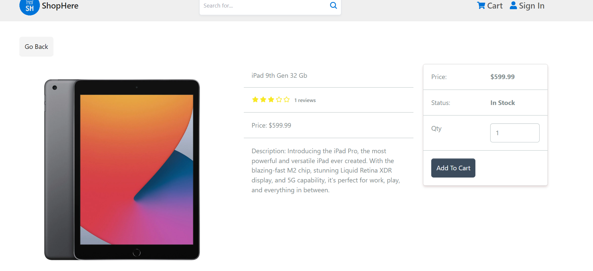

# ShopHere - E-Commerce Web Application 🛍️

ShopHere is a full-stack e-commerce web application developed using the MERN stack (MongoDB, Express.js, React.js, and Node.js). This project focuses on creating a seamless shopping experience for users while providing efficient management tools for administrators.

## Features ✨

- **MERN Stack**: Utilized MongoDB, Express.js, React.js, and Node.js for full-stack development.
- **Redux State Management**: Implemented Redux and Redux Toolkit for efficient state management.
- **User Authentication**: Implemented user-friendly login and registration functionalities for both users and administrators.
- **JWT Security**: Ensured secure access to the platform using JSON Web Tokens (JWT).
- **Admin Panel**: Designed and implemented an intuitive admin panel for product and user management.
- **Product Management**: Enabled efficient creation, updating, and deletion of products.
- **User Management**: Facilitated user management operations for administrators.
- **Image Upload**: Enabled seamless image uploading using Multer.
- **Payment Integration**: Integrated PayPal for secure transactions.

## Technologies Used 🛠️

### Backend
- **bcrypt**
- **cookie-parser**
- **express**
- **jsonwebtoken**
- **mongoose**
- **multer**

### Frontend
- **react**
- **react-redux**
- **@paypal/react-paypal-js**
- **@reduxjs/toolkit**
- **@tailwindcss/forms**
- **axios**
- **react-router-dom**
- **bootstrap**


## Installation 🚀

### Backend

1. Clone the repository.
    ```bash
    git clone https://github.com/yourusername/shophere.git
    ```
2. Install backend dependencies using npm.
    ```bash
    cd shophere
    npm install
    ```
3. Run the backend server.
    ```bash
    npm run server
    ```

### Frontend

1. Navigate to the frontend directory.
    ```bash
    cd frontend
    ```
2. Install frontend dependencies using npm.
    ```bash
    npm install
    ```
3. Start the frontend development server.
    ```bash
    npm run dev
    ```

### Full Project

1. Start both backend and frontend servers concurrently.
    ```bash
    npm run dev
    ```

## Scripts

### Backend Scripts
- **start**: `node backend/server.js`
- **server**: `nodemon backend/server.js`
- **client**: `npm run dev --prefix frontend`
- **dev**: `concurrently "npm run server" "npm run client"`
- **data:import**: `node backend/seeder.js`
- **data:destroy**: `node backend/seeder.js -d`
- **build**: `npm install && npm install --prefix frontend && npm run build --prefix frontend`

### Frontend Scripts
- **dev**: `vite --host`
- **build**: `vite build`
- **lint**: `eslint . --ext js,jsx --report-unused-disable-directives --max-warnings 0`
- **preview**: `vite preview`

## How to Use 🛒

1. Register as a user or login if you are an existing user.
2. Explore the products and add them to your cart.
3. Proceed to checkout and make secure payments via PayPal.
4. Administrators can log in to the admin panel to manage products and users.

## Screenshots 📸





## Demo 🎥

Here is a quick demo of ShopHere: [Demo Link](https://shophere-m5ln.onrender.com/)

## Author 👤

**Developed by:** Jaymin Mistry  
**Email:** [jayminmistry101@gmail.com](mailto:jayminmistry101@gmail.com)

Feel free to reach out for any questions or feedback. 

## License 📄

This project is licensed under the MIT License.
